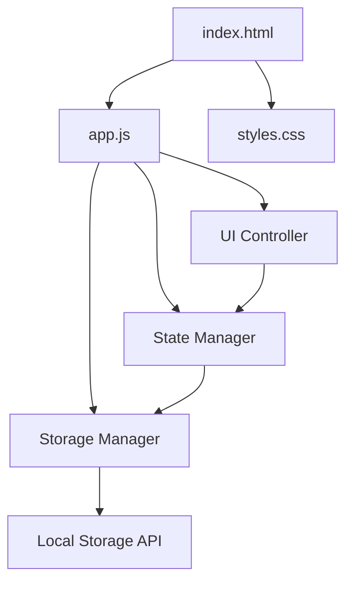

# Design Document: To-Do List Life Dashboard

## Overview

The To-Do List Life Dashboard is a single-page web application built with vanilla HTML, CSS, and JavaScript. The application provides a personal productivity interface with four main components:

1. **Greeting Component**: Displays current time, date, and time-based greeting
2. **Focus Timer**: 25-minute Pomodoro-style countdown timer
3. **Todo List Manager**: Task creation, editing, completion tracking, and deletion
4. **Quick Links**: Customizable shortcuts to favorite websites

All data persistence is handled through the browser's Local Storage API, making the application entirely client-side with no backend dependencies. The design prioritizes simplicity, performance, and maintainability through a modular architecture with clear separation of concerns.

### Design Principles

- **Vanilla Technologies**: No frameworks or build tools - pure HTML/CSS/JavaScript
- **Client-Side Only**: All logic and storage handled in the browser
- **Modular Architecture**: Clear separation between UI rendering, state management, and storage
- **Progressive Enhancement**: Core functionality works immediately, with enhancements layered on top
- **Performance First**: Minimal DOM manipulation, efficient event handling, debounced updates

## Architecture

### High-Level Architecture



### Component Structure

The application follows a Model-View-Controller (MVC) inspired pattern:

**Model Layer (State Manager)**
- Maintains in-memory application state
- Provides methods for state mutations
- Notifies observers of state changes

**View Layer (UI Controller)**
- Renders components based on current state
- Handles DOM manipulation
- Manages event listeners

**Storage Layer (Storage Manager)**
- Abstracts Local Storage operations
- Serializes/deserializes data structures
- Handles storage errors gracefully

### Module Organization

```
/
├── index.html          # Main HTML structure
├── css/
│   └── styles.css      # All styling rules
└── js/
    └── app.js          # All JavaScript logic
```

The single JavaScript file (`app.js`) will be organized into logical sections:

1. **Storage Manager**: Local Storage abstraction
2. **State Manager**: Application state management
3. **Greeting Component**: Time/date/greeting logic
4. **Timer Component**: Focus timer logic
5. **Todo Component**: Task management logic
6. **Quick Links Component**: Link management logic
7. **Initialization**: App bootstrap and event binding

## Components and Interfaces

### 1. Storage Manager

**Purpose**: Provides a clean interface to Local Storage with error handling and data validation.

**Interface**:
```javascript
const StorageManager = {
  // Save data to Local Storage
  save(key, data): boolean
  
  // Load data from Local Storage
  load(key): any | null
  
  // Remove data from Local Storage
  remove(key): boolean
  
  // Check if key exists
  has(key): boolean
}
```

**Implementation Details**:
- Uses `JSON.stringify()` for serialization
- Uses `JSON.parse()` for deserialization
- Wraps all operations in try-catch for error handling
- Returns null on parse errors or missing keys
- Storage keys: `'todos'`, `'quickLinks'`

### 2. State Manager

**Purpose**: Maintains application state and provides mutation methods.

**Interface**:
```javascript
const StateManager = {
  // State structure
  state: {
    todos: [],
    quickLinks: [],
    timerSeconds: 1500,
    timerRunning: false
  },
  
  // Todo operations
  addTodo(text): void
  updateTodo(id, text): void
  toggleTodo(id): void
  deleteTodo(id): void
  
  // Quick link operations
  addQuickLink(name, url): void
  deleteQuickLink(id): void
  
  // Timer operations
  setTimerSeconds(seconds): void
  setTimerRunning(running): void
  
  // Persistence
  loadState(): void
  saveState(): void
}
```

**Implementation Details**:
- Todos stored as array of objects: `{ id, text, completed, createdAt }`
- Quick links stored as array of objects: `{ id, name, url }`
- IDs generated using `Date.now()` for simplicity
- State mutations trigger automatic persistence
- Initial load happens on app initialization

### 3. Greeting Component

**Purpose**: Displays current time, date, and contextual greeting.

**Interface**:
```javascript
const GreetingComponent = {
  // Initialize component
  init(containerElement): void
  
  // Update display (called every second)
  update(): void
  
  // Get time-based greeting
  getGreeting(hour): string
  
  // Format time as 12-hour with AM/PM
  formatTime(date): string
  
  // Format date as "Day, Month Date"
  formatDate(date): string
}
```

**Implementation Details**:
- Uses `setInterval()` with 1000ms interval for updates
- Greeting logic based on hour ranges:
  - 5-11: "Good Morning"
  - 12-17: "Good Afternoon"
  - 18-20: "Good Evening"
  - 21-4: "Good Night"
- Time format: "h:mm:ss AM/PM"
- Date format: "DayOfWeek, Month Day" (e.g., "Monday, January 15")

### 4. Timer Component

**Purpose**: Implements 25-minute focus timer with start/stop/reset controls.

**Interface**:
```javascript
const TimerComponent = {
  // Initialize component
  init(containerElement): void
  
  // Start countdown
  start(): void
  
  // Stop/pause countdown
  stop(): void
  
  // Reset to 25 minutes
  reset(): void
  
  // Update display
  updateDisplay(): void
  
  // Format seconds as MM:SS
  formatTime(seconds): string
  
  // Handle timer completion
  onComplete(): void
}
```

**Implementation Details**:
- Uses `setInterval()` with 1000ms interval when running
- Stores interval ID for cleanup
- Default duration: 1500 seconds (25 minutes)
- Displays "00:00" when complete
- Plays browser notification or alert on completion
- Automatically stops at zero
- Updates state manager on changes

### 5. Todo Component

**Purpose**: Manages task list with create, edit, complete, and delete operations.

**Interface**:
```javascript
const TodoComponent = {
  // Initialize component
  init(containerElement): void
  
  // Render all todos
  render(): void
  
  // Handle form submission
  handleAdd(event): void
  
  // Handle edit button click
  handleEdit(id): void
  
  // Handle toggle completion
  handleToggle(id): void
  
  // Handle delete button click
  handleDelete(id): void
  
  // Validate input
  validateInput(text): boolean
}
```

**Implementation Details**:
- Renders todos in creation order (oldest first)
- Edit mode: replaces task text with input field
- Completed tasks: visual styling (strikethrough, opacity)
- Empty input validation: trims whitespace
- Each todo has three buttons: edit, done, delete
- Uses event delegation for button clicks
- Re-renders entire list on state changes

### 6. Quick Links Component

**Purpose**: Manages customizable website shortcuts.

**Interface**:
```javascript
const QuickLinksComponent = {
  // Initialize component
  init(containerElement): void
  
  // Render all quick links
  render(): void
  
  // Handle form submission
  handleAdd(event): void
  
  // Handle link click
  handleClick(url): void
  
  // Handle delete button click
  handleDelete(id): void
  
  // Validate and normalize URL
  normalizeUrl(url): string
  
  // Validate input
  validateInput(name, url): boolean
}
```

**Implementation Details**:
- Opens links in new tab using `window.open(url, '_blank')`
- URL normalization: prepends "https://" if no protocol present
- Empty input validation for both name and URL
- Each link displayed as button with delete icon
- Uses event delegation for clicks
- Re-renders entire list on state changes

### 7. Application Initialization

**Purpose**: Bootstrap the application and coordinate components.

**Interface**:
```javascript
const App = {
  // Initialize all components
  init(): void
  
  // Set up event listeners
  bindEvents(): void
  
  // Handle errors
  handleError(error): void
}
```

**Implementation Details**:
- Loads state from Local Storage on startup
- Initializes all components in order
- Sets up global error handler
- Starts greeting and timer update loops
- Ensures DOM is ready before initialization

## Data Models

### Todo Item

```javascript
{
  id: number,           // Unique identifier (timestamp)
  text: string,         // Task description
  completed: boolean,   // Completion status
  createdAt: number     // Creation timestamp
}
```

**Constraints**:
- `id`: Must be unique, generated via `Date.now()`
- `text`: Must be non-empty after trimming whitespace
- `completed`: Defaults to `false` on creation
- `createdAt`: Set once on creation, never modified

### Quick Link Item

```javascript
{
  id: number,      // Unique identifier (timestamp)
  name: string,    // Display label
  url: string      // Target URL (normalized with protocol)
}
```

**Constraints**:
- `id`: Must be unique, generated via `Date.now()`
- `name`: Must be non-empty after trimming whitespace
- `url`: Must be non-empty, automatically normalized with "https://" prefix if missing protocol

### Timer State

```javascript
{
  seconds: number,     // Remaining time in seconds
  running: boolean     // Whether timer is actively counting down
}
```

**Constraints**:
- `seconds`: Integer between 0 and 1500 (25 minutes)
- `running`: Boolean flag, defaults to `false`
- Timer resets to 1500 when reset button clicked

### Local Storage Schema

**Key: `'todos'`**
```javascript
[
  { id: 1234567890, text: "Complete project", completed: false, createdAt: 1234567890 },
  { id: 1234567891, text: "Review code", completed: true, createdAt: 1234567891 }
]
```

**Key: `'quickLinks'`**
```javascript
[
  { id: 1234567892, name: "GitHub", url: "https://github.com" },
  { id: 1234567893, name: "Gmail", url: "https://mail.google.com" }
]
```

## Correctness Properties

*A property is a characteristic or behavior that should hold true across all valid executions of a system—essentially, a formal statement about what the system should do. Properties serve as the bridge between human-readable specifications and machine-verifiable correctness guarantees.*


### Property 1: Time Format Validity

*For any* valid Date object, the time formatting function SHALL produce a string in 12-hour format with hours (1-12), minutes (00-59), seconds (00-59), and AM/PM indicator.

**Validates: Requirements 1.1, 1.4**

### Property 2: Date Format Validity

*For any* valid Date object, the date formatting function SHALL produce a string containing the day of week, month name, and day number.

**Validates: Requirements 1.2, 1.4**

### Property 3: Greeting Time Range Correctness

*For any* hour value (0-23), the greeting function SHALL return exactly one of four greetings based on the hour: "Good Morning" (5-11), "Good Afternoon" (12-16), "Good Evening" (17-20), or "Good Night" (21-4).

**Validates: Requirements 2.1, 2.2, 2.3, 2.4**

### Property 4: Timer Format Validity

*For any* integer number of seconds between 0 and 1500, the timer formatting function SHALL produce a string in MM:SS format where MM is 00-25 and SS is 00-59.

**Validates: Requirements 3.6**

### Property 5: Task Toggle Idempotence

*For any* task object, toggling the completion status twice SHALL result in the task returning to its original completion state.

**Validates: Requirements 4.3**

### Property 6: Task Deletion Removes Exactly One Item

*For any* non-empty task list and any valid task ID in that list, deleting the task SHALL reduce the list length by exactly one and the deleted task SHALL no longer be present.

**Validates: Requirements 4.4**

### Property 7: Task Ordering Preservation

*For any* list of tasks, sorting by createdAt timestamp SHALL produce a stable ordering where tasks created earlier appear before tasks created later.

**Validates: Requirements 4.5**

### Property 8: Whitespace Input Rejection

*For any* string composed entirely of whitespace characters (spaces, tabs, newlines), the input validation function SHALL reject it as invalid for both task text and quick link name/URL fields.

**Validates: Requirements 4.7, 6.5**

### Property 9: Data Serialization Round-Trip

*For any* valid task object or quick link object, serializing to JSON and then deserializing SHALL produce an object with identical field values (id, text/name, completed/url, createdAt where applicable).

**Validates: Requirements 5.6, 7.4**

### Property 10: URL Normalization Correctness

*For any* URL string, the normalization function SHALL prepend "https://" if and only if the URL does not already contain a protocol scheme (http://, https://, ftp://, etc.).

**Validates: Requirements 6.6**

## Error Handling

### Local Storage Errors

**Quota Exceeded**
- Scenario: User exceeds browser storage limit
- Handling: Catch `QuotaExceededError`, display user-friendly message, prevent further additions
- Recovery: Suggest deleting old items to free space

**Storage Unavailable**
- Scenario: Private browsing mode or storage disabled
- Handling: Detect on initialization, display warning message
- Fallback: Application continues to work with in-memory state only (data lost on refresh)

**Parse Errors**
- Scenario: Corrupted data in Local Storage
- Handling: Catch JSON parse errors, log to console, clear corrupted key
- Recovery: Initialize with empty state for that data type

### Input Validation Errors

**Empty Input**
- Scenario: User submits empty or whitespace-only text
- Handling: Prevent submission, show validation message near input field
- User Feedback: "Please enter a task description" or "Please enter a name and URL"

**Invalid URL Format**
- Scenario: User enters malformed URL (handled by normalization)
- Handling: Attempt to normalize by adding protocol
- Fallback: If normalization fails, accept as-is (browser will handle on click)

### Timer Errors

**Interval Cleanup**
- Scenario: Component unmounted or page unloaded while timer running
- Handling: Clear interval on page unload event
- Prevention: Store interval ID and clear on stop/reset

### General Error Handling

**Uncaught Exceptions**
- Handling: Global error handler logs to console
- User Feedback: Application continues to function for other components
- Isolation: Component errors don't crash entire application

## Testing Strategy

### Overview

The To-Do List Life Dashboard testing strategy employs a dual approach:

1. **Property-Based Tests**: Verify universal correctness properties for pure logic functions
2. **Unit Tests**: Verify specific behaviors, edge cases, and integration points
3. **Integration Tests**: Verify component interactions and browser API usage
4. **Manual Testing**: Verify visual design, browser compatibility, and performance

### Property-Based Testing

**Framework**: fast-check (JavaScript property-based testing library)

**Configuration**:
- Minimum 100 iterations per property test
- Each test tagged with format: `Feature: todo-list-life-dashboard, Property {number}: {property_text}`

**Test Coverage**:

1. **Time Formatting** (Property 1)
   - Generator: Random Date objects
   - Assertion: Output matches regex `/^(1[0-2]|[1-9]):[0-5][0-9]:[0-5][0-9] (AM|PM)$/`

2. **Date Formatting** (Property 2)
   - Generator: Random Date objects
   - Assertion: Output contains valid day name, month name, and day number

3. **Greeting Logic** (Property 3)
   - Generator: Random integers 0-23 (hours)
   - Assertion: Output is one of four greetings and matches expected range

4. **Timer Formatting** (Property 4)
   - Generator: Random integers 0-1500 (seconds)
   - Assertion: Output matches regex `/^[0-2][0-9]:[0-5][0-9]$/` and converts back to correct seconds

5. **Task Toggle** (Property 5)
   - Generator: Random task objects
   - Assertion: `toggle(toggle(task)).completed === task.completed`

6. **Task Deletion** (Property 6)
   - Generator: Random task arrays and valid indices
   - Assertion: Length decreases by 1, deleted ID not in result

7. **Task Ordering** (Property 7)
   - Generator: Random task arrays with timestamps
   - Assertion: Sorted array has monotonically increasing createdAt values

8. **Input Validation** (Property 8)
   - Generator: Random whitespace strings (spaces, tabs, newlines)
   - Assertion: All rejected by validation function

9. **Serialization Round-Trip** (Property 9)
   - Generator: Random task and quick link objects
   - Assertion: `JSON.parse(JSON.stringify(obj))` deep equals original

10. **URL Normalization** (Property 10)
    - Generator: Random URLs with/without protocols
    - Assertion: Result always has protocol, original protocol preserved if present

### Unit Testing

**Framework**: Jest or Vitest (lightweight, fast)

**Test Coverage**:

1. **Greeting Component**
   - Initialization creates DOM elements
   - Update function called on interval
   - Cleanup clears interval

2. **Timer Component**
   - Initial state is 1500 seconds, not running
   - Start button begins countdown
   - Stop button pauses countdown
   - Reset button returns to 1500
   - Countdown stops at zero
   - Completion triggers notification

3. **Todo Component**
   - Add creates new task with unique ID
   - Edit mode replaces text with input
   - Toggle changes completion status
   - Delete removes task
   - Empty input prevented
   - Completed tasks have visual distinction

4. **Quick Links Component**
   - Add creates new link with unique ID
   - Click opens URL in new tab
   - Delete removes link
   - Empty name/URL prevented
   - URL normalized on creation

5. **Storage Manager**
   - Save writes to Local Storage
   - Load retrieves from Local Storage
   - Parse errors return null
   - Quota errors caught and handled

6. **State Manager**
   - Mutations update state correctly
   - State changes trigger persistence
   - Initial load populates from storage

### Integration Testing

**Approach**: Manual testing with browser DevTools

**Test Scenarios**:

1. **End-to-End Task Flow**
   - Add task → verify in DOM and Local Storage
   - Edit task → verify update persisted
   - Toggle task → verify visual change and persistence
   - Delete task → verify removal from DOM and storage
   - Refresh page → verify tasks restored

2. **End-to-End Quick Link Flow**
   - Add link → verify in DOM and Local Storage
   - Click link → verify new tab opens
   - Delete link → verify removal
   - Refresh page → verify links restored

3. **Timer Flow**
   - Start timer → verify countdown
   - Stop timer → verify pause
   - Reset timer → verify return to 25:00
   - Run to completion → verify notification

4. **Time Updates**
   - Verify time updates every second
   - Verify greeting changes at boundary hours
   - Verify date updates at midnight

### Browser Compatibility Testing

**Target Browsers**:
- Chrome (latest stable)
- Firefox (latest stable)
- Edge (latest stable)
- Safari (latest stable)

**Test Approach**:
- Manual testing on each browser
- Verify all features work correctly
- Check for console errors
- Verify Local Storage functionality
- Test visual rendering consistency

### Performance Testing

**Metrics**:
- Initial load time < 1 second
- Interaction response < 100ms
- No visible jank during updates

**Tools**:
- Chrome DevTools Performance tab
- Lighthouse performance audit

**Test Scenarios**:
- Load with 100 tasks
- Load with 50 quick links
- Rapid task additions
- Timer running with other interactions

### Visual Design Testing

**Approach**: Manual review against design requirements

**Checklist**:
- ✓ Minimal visual design
- ✓ Readable typography
- ✓ Clear visual hierarchy
- ✓ Consistent spacing
- ✓ Sufficient color contrast (WCAG AA minimum)

### Test Execution

**Development Workflow**:
1. Write property-based tests for pure functions
2. Write unit tests for component logic
3. Run tests on file save (watch mode)
4. Manual integration testing before commit
5. Browser compatibility testing before release

**Continuous Integration**:
- Not applicable (no build process or CI pipeline for this simple project)
- Tests run locally before deployment

## Implementation Notes

### Performance Optimizations

1. **Debounced Storage**: Consider debouncing Local Storage writes if performance issues arise
2. **Event Delegation**: Use event delegation for dynamic lists (todos, quick links)
3. **Minimal Re-renders**: Only update changed DOM elements, avoid full re-renders when possible
4. **Efficient Selectors**: Cache DOM element references in component initialization

### Accessibility Considerations

While not explicitly required, basic accessibility should be considered:
- Semantic HTML elements (button, form, input)
- Keyboard navigation support (tab order)
- ARIA labels for icon buttons
- Focus indicators for interactive elements

### Browser API Usage

**Local Storage**:
- `localStorage.setItem(key, value)`
- `localStorage.getItem(key)`
- `localStorage.removeItem(key)`

**Timers**:
- `setInterval(callback, delay)` for greeting and timer updates
- `clearInterval(id)` for cleanup

**Date/Time**:
- `new Date()` for current time
- `Date.prototype.getHours()`, `getMinutes()`, `getSeconds()`
- `Date.prototype.getDay()`, `getMonth()`, `getDate()`

**Window**:
- `window.open(url, '_blank')` for quick links

### Code Organization Best Practices

1. **Single Responsibility**: Each component manages one feature
2. **Pure Functions**: Extract formatting and validation logic as pure functions
3. **Immutability**: Avoid mutating state directly, create new objects
4. **Error Boundaries**: Wrap risky operations in try-catch
5. **Comments**: Document complex logic and browser quirks

### Future Enhancements (Out of Scope)

- Task categories or tags
- Task due dates and reminders
- Timer customization (different durations)
- Multiple timer presets
- Task search and filtering
- Export/import functionality
- Dark mode theme
- Responsive mobile layout
- Keyboard shortcuts

